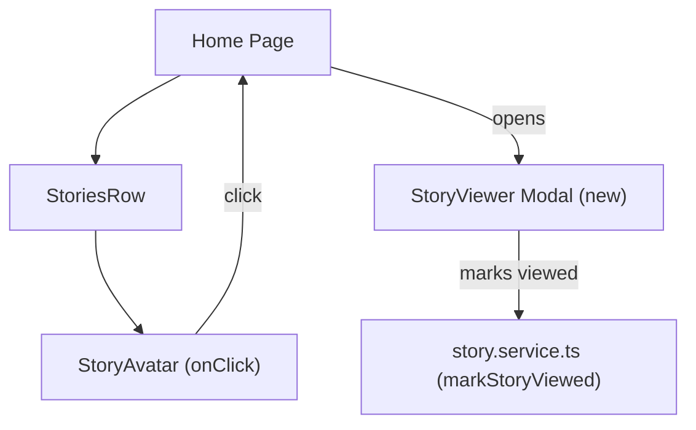

# Story Viewer Modal

## Context

The app already has a stories row on the home page that renders one avatar per user. Clicking an avatar does nothing yet. The building blocks are in place:

- [story.service.ts](../src/services/story.service.ts) -- `markStoryViewed(storyId, userId)` already exists and updates localStorage
- [StoryAvatar.tsx](../src/components/ui/StoryAvatar.tsx) -- already accepts an `onClick` prop (currently not wired)
- [StoriesRow.tsx](../src/components/ui/StoriesRow.tsx) -- deduplicates stories by user, will pass `onClick` to avatars
- [story.types.ts](../src/types/story.types.ts) -- `Story` type with `_id`, `imgUrl`, `txt`, `by`, `viewedBy`
- [var.css](../src/style/setup/var.css) -- CSS custom properties for colors, spacing, transitions

We're building a full-screen modal story viewer (Instagram-style) that:

- Opens when clicking any `StoryAvatar` in the `StoriesRow`
- Displays the story image with optional overlay text
- Shows a timed progress bar that auto-advances after ~5 seconds
- Navigates between users' stories (tap left/right, keyboard arrows)
- Marks stories as viewed via the existing `markStoryViewed` service
- Closes on Escape, close button, or clicking the backdrop

---

## 1. Architecture



---

## 2. New component -- StoryViewer

File: `src/components/ui/StoryViewer.tsx` (new)

### Props

```ts
interface Props {
  stories: Story[]            // all stories in feed order (not deduplicated)
  initialUserIndex: number    // which user's story to start on
  userOrder: MiniUser[]       // ordered list of users from StoriesRow
  currentUserId: string       // logged-in user's ID
  onClose: () => void
}
```

### Behavior

- Group stories by user (`Map<userId, Story[]>`)
- Track `activeUserIdx` and `activeStoryIdx` within that user's stories
- 5-second auto-advance timer via `setInterval` + CSS animation for the progress bar
- Tap/click left half = go back one story; right half = go forward
- When last story for a user ends, advance to the next user; when last user's last story ends, close
- Call `markStoryViewed` when each story is displayed
- Render via a React portal into `document.body` for proper stacking

### Layout (inside modal overlay)

- **Top:** progress bar segments (one per story for current user), user avatar + username + time ago, close (X) button
- **Center:** story image (`object-fit: contain`, portrait-oriented)
- **Bottom:** optional overlay text (`story.txt`)
- **Left/right tap zones:** invisible, 50% width each

---

## 3. CSS -- StoryViewer.css

File: `src/style/cmps/StoryViewer.css` (new)

```css
/* Fixed overlay */
.story-viewer-overlay {
  position: fixed;
  inset: 0;
  z-index: 1000;
  background: rgba(0, 0, 0, 0.95);
}

/* Story container -- centered, 9:16 aspect feel */
.story-viewer-container {
  max-width: 440px;
  max-height: 780px;
}

/* Progress bar -- fill animation over 5s */
@keyframes progress-fill {
  from { width: 0; }
  to { width: 100%; }
}
```

Key rules:

- Progress bar: flex row of segments at top; each segment has `progress-fill` animation over 5s
- Viewed segments fill instantly; current segment animates; future segments stay empty
- Tap zones: absolute-positioned left/right halves, no visible border
- Close button: absolute top-right, white X icon (Lucide `X`)
- Transition on story change for a subtle crossfade

---

## 4. Changes to existing files

- `src/components/ui/StoriesRow.tsx` -- accept `onStoryClick(userIndex: number)` prop, pass `onClick` to each `StoryAvatar`
- `src/pages/Home.tsx` -- add state for `storyViewerOpen` + `initialUserIndex`, render `StoryViewer` when open, pass stories + handler to `StoriesRow`
- `src/style/main.css` -- add `@import './cmps/StoryViewer.css'`

### New files

- `src/components/ui/StoryViewer.tsx` -- the modal component
- `src/style/cmps/StoryViewer.css` -- modal styles (overlay, progress bar, layout, animations)

---

## 5. Keyboard support

| Key | Action |
|-----|--------|
| `ArrowRight` / `ArrowDown` | Next story |
| `ArrowLeft` / `ArrowUp` | Previous story |
| `Escape` | Close viewer |

Handled via `useEffect` with a `keydown` listener.

---

## 6. Story ordering logic

Stories are grouped by user in the order they appear in `StoriesRow` (i.e., `uniqueByUser` order). Within each user, stories are sorted by `createdAt` (oldest first so you watch chronologically). Unviewed users appear before viewed users (matching Instagram behavior -- `StoriesRow` can be updated to sort this way).
