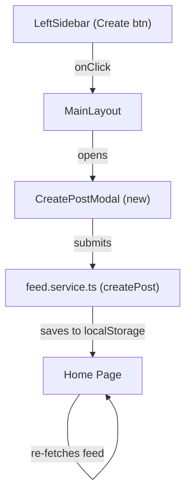

# Post Creation Modal

## Context

The left sidebar already has a "Create" button (`PlusSquare` icon) in [LeftSidebar.tsx](../src/components/layout/LeftSidebar.tsx) that is currently a no-op. The service layer already has a `createPost` function in [feed.service.ts](../src/services/feed.service.ts) that accepts a post object, generates an ID, and saves to localStorage. The `Post` type in [post.types.ts](../src/types/post.types.ts) requires `imgUrl`, `by`, `createdAt`, `likes`, `comments`, and optional `caption`, `location`, `tags`.

Since there is no backend or file upload, images will be provided via URL input (with a curated set of placeholder images from picsum.photos as quick-select options).

The [initial project plan](./002-initial-proj.md) places modals under `components/modals/`, and this component follows the same portal-based pattern used in [StoryViewer.tsx](../src/components/ui/StoryViewer.tsx).

---

## 1. Architecture



---

## 2. New component -- CreatePostModal

File: `src/components/ui/CreatePostModal.tsx` (or `src/components/modals/CreatePostModal.tsx` -- see questions)

### Props

```ts
interface Props {
  currentUser: MiniUser
  onClose: () => void
  onPostCreated: (post: Post) => void
}
```

### Multi-step flow (2 steps)

- **Step 1 -- Image selection:** User enters an image URL or picks from a grid of ~6 placeholder images (picsum.photos seeds). A preview of the selected image is shown. "Next" button advances to step 2.
- **Step 2 -- Details:** Shows the image preview on the left, a form on the right with: caption textarea, location input (text only), tags input (comma-separated). "Share" button submits.

### Behavior

- Renders via `createPortal` to `document.body` (same pattern as StoryViewer)
- Escape key and backdrop click close the modal
- Body scroll locked while open (`document.body.style.overflow = 'hidden'`)
- On submit: calls `createPost()` from `feed.service.ts`, then calls `onPostCreated` with the new post so the parent can update the feed
- Validates that an image URL is provided before allowing submit
- Clears form state on close

### Layout (inside modal overlay)

- **Header:** Step title ("Create new post"), close X button, back/next navigation
- **Body:** Step 1 = image picker area; Step 2 = split layout (image preview + form)
- Centered card on dark overlay, max-width ~720px for step 2, ~480px for step 1

---

## 3. CSS -- CreatePostModal.css

File: `src/style/cmps/CreatePostModal.css`

Key rules:

- Reuse the overlay pattern from StoryViewer.css (fixed overlay, z-index 1000, dark backdrop)
- Modal card with `--clr-bg-elevated` background, `--radius-lg` border radius
- Step 1: centered image URL input + placeholder image grid (3x2 grid)
- Step 2: flexbox split layout -- image on left (~50%), form on right (~50%)
- Form inputs styled consistently with the existing comment input pattern from PostCard.css
- "Share" button uses `--clr-accent` background (primary action)
- Responsive: stack vertically on screens narrower than 640px
- Subtle transition between steps

---

## 4. Changes to existing files

### LeftSidebar.tsx

The "Create" button calls an `onCreateClick` prop (passed down from `MainLayout`).

### MainLayout.tsx

- Add state: `createModalOpen` (boolean)
- Pass `onCreateClick` to `LeftSidebar` to toggle the modal
- Render `CreatePostModal` when open (portal, so placement doesn't matter structurally)
- Pass `onPostCreated` callback through React Router's `<Outlet context>` so Home can receive it

### Home.tsx

- Read `onPostCreated` from outlet context
- When a post is created, prepend it to the local `posts` state

### main.css

- Add `@import './cmps/CreatePostModal.css'`

---

## 5. Data flow for post creation

1. User clicks "Create" in sidebar
2. `MainLayout` sets `createModalOpen = true`
3. `CreatePostModal` renders (portal)
4. User selects image URL, writes caption/location/tags, clicks "Share"
5. Modal calls `createPost()` with the assembled post object
6. `onPostCreated(newPost)` fires, Home prepends it to feed
7. Modal closes

---

## 6. Keyboard and accessibility

- `Escape` closes modal
- "Share" button disabled until image is selected
- Inputs have proper placeholders
- Close button has `aria-label`

---

## Questions (resolved)

1. **Component location** -- `components/ui/` for consistency with StoryViewer.
2. **Image source** -- URL input + picsum placeholder grid as quick picks.
3. **Feed refresh** -- Both Home and Profile will reflect the new post immediately (createPost saves to localStorage first, Profile reads from it on mount).
4. **Discard confirmation** -- Show a "Discard post?" confirmation dialog when user has entered data and tries to close.
