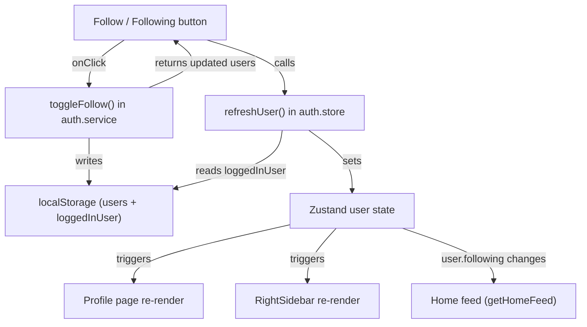

# Follow / Unfollow

## Context

Two "Follow" buttons already exist in the UI but are no-ops:

- **Profile page** ([Profile.tsx](../src/pages/Profile.tsx), line 46) -- shown when viewing another user's profile
- **Right sidebar** ([RightSidebar.tsx](../src/components/layout/RightSidebar.tsx), line 38) -- one per suggested user

The `User` type ([user.types.ts](../src/types/user.types.ts)) already carries `followers: MiniUser[]`, `following: MiniUser[]`, `followersCount`, and `followingCount`. The service layer ([auth.service.ts](../src/services/auth.service.ts)) has `getUsers()`, `_saveUsers()`, and user lookup helpers. The Zustand auth store ([auth.store.ts](../src/store/auth.store.ts)) holds the logged-in `User`.

`getSuggestedUsers()` already filters out users the current user follows, and `getHomeFeed()` uses `user.following` to decide which posts to show -- so follow/unfollow will automatically affect both suggestions and the feed on next render.

---

## 1. Architecture



---

## 2. Service function -- `toggleFollow`

Add to [auth.service.ts](../src/services/auth.service.ts):

```ts
export function toggleFollow(
  currentUserId: string,
  targetUserId: string
): { currentUser: User; targetUser: User } | undefined
```

Logic:
- Load all users from localStorage
- Find both users; return `undefined` if either is missing or same user (self-follow guard)
- If current user already follows target -> **unfollow**: remove each from the other's arrays, decrement counts
- Otherwise -> **follow**: add each to the other's arrays, increment counts
- Save users back to localStorage
- Also update `loggedInUser` in localStorage to keep it in sync
- Return both updated users

Follows the existing service pattern (`toggleLike`, `toggleSave`) of mutating localStorage data and returning the updated entity.

---

## 3. Auth store -- `refreshUser` action

Add to [auth.store.ts](../src/store/auth.store.ts):

```ts
refreshUser: () => {
  const user = authService.getLoggedInUser()
  if (user) set({ user })
}
```

Components call `refreshUser()` after `toggleFollow()` so the Zustand state reflects the updated `following`/`followers` arrays.

---

## 4. Profile page -- wire up button

In [Profile.tsx](../src/pages/Profile.tsx):

- Import `toggleFollow` and `useAuthStore`'s `refreshUser`
- Derive `isFollowing` from `currentUser.following.some(u => u._id === profileUser._id)`
- Replace the static `<button className="btn-follow">Follow</button>` with:
  - If following: `<button className="btn-following">Following</button>` (hover shows "Unfollow")
  - If not following: `<button className="btn-follow">Follow</button>`
- `onToggleFollow` handler:
  1. Call `toggleFollow(currentUser._id, profileUser._id)`
  2. Call `refreshUser()` to update Zustand
  3. Re-fetch `profileUser` via `getUserByUsername` to update displayed follower count
- Track hover state on the "Following" button so text switches to "Unfollow" on hover

---

## 5. Right sidebar -- wire up buttons

In [RightSidebar.tsx](../src/components/layout/RightSidebar.tsx):

- Import `toggleFollow` and the store's `refreshUser`
- On "Follow" click: call `toggleFollow`, then `refreshUser()`
- After `refreshUser()`, the component re-renders because `user` from Zustand changes, and `getSuggestedUsers()` recalculates -- the followed user disappears from the suggestions list automatically

---

## 6. CSS -- button states

Add to [base.css](../src/style/basics/base.css) alongside the existing `.btn-follow`:

```css
.btn-following {
  padding: 0.4em 1em;
  font-size: 0.8125rem;
  font-weight: 600;
  color: var(--clr-text);
  background: var(--clr-bg-elevated);
  border: 1px solid var(--clr-border);
  border-radius: var(--radius-md);
  cursor: pointer;
  transition: background var(--transition-fast), color var(--transition-fast),
    border-color var(--transition-fast);

  &:hover {
    color: var(--clr-error);
    border-color: var(--clr-error);
    background: var(--clr-error-bg, rgba(239, 68, 68, 0.1));
  }
}
```

The hover state turns red to signal "Unfollow" (Instagram pattern). The button text switches to "Unfollow" on hover via React state, keeping it accessible.

---

## 7. Edge cases

- **Self-follow prevention**: `toggleFollow` returns `undefined` if `currentUserId === targetUserId` (extra guard; UI already hides the button for own profile)
- **Count consistency**: counts are incremented/decremented alongside array mutations, matching existing patterns
- **Home feed**: after unfollowing from Profile, navigating to Home shows an updated feed because `getHomeFeed` reads `user.following` from the refreshed Zustand state

---

## Questions (resolved)

1. **RightSidebar after follow** -- the followed user disappears from the suggestions list instantly (Instagram behavior). This happens automatically because `getSuggestedUsers` filters out followed users.
