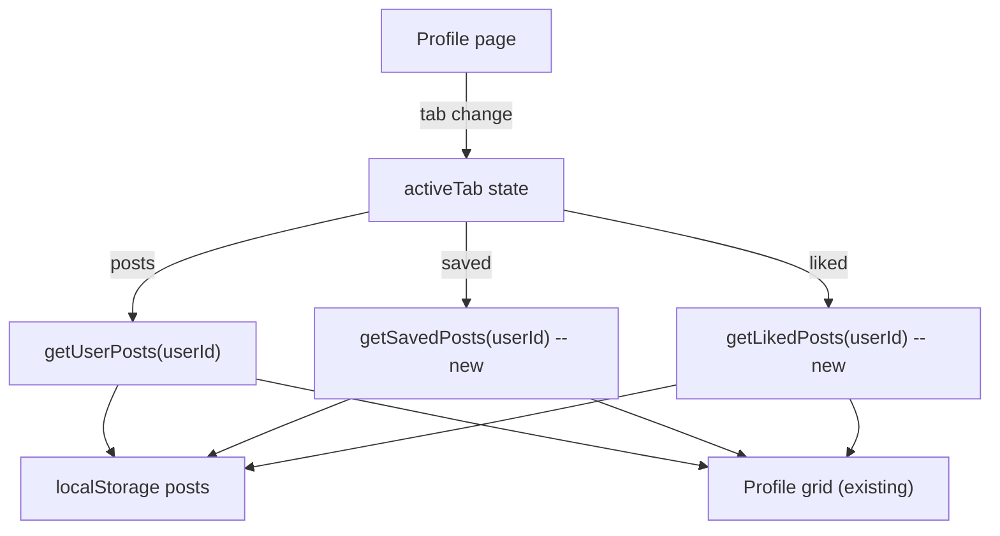

# Profile Tabs (Saved / Liked)

## Context

The Profile page ([Profile.tsx](../src/pages/Profile.tsx)) already renders three tabs -- Posts, Saved, and Liked -- with a `Tab` type union and active-tab state. The Saved and Liked tabs are only visible on the current user's own profile (guarded by `isOwnProfile`). However, switching to those tabs currently shows a static "No saved/liked posts yet" message because no data is fetched.

The data to power these tabs already exists:
- **Saved** -- `Post.savedBy?: string[]` is maintained by `toggleSave()` in [feed.service.ts](../src/services/feed.service.ts)
- **Liked** -- `Post.likes.likedBy: MiniUser[]` is maintained by `toggleLike()` in feed.service.ts

The `User` type ([user.types.ts](../src/types/user.types.ts)) also has `savedPostIds?: string[]` and `likedPostIds?: string[]`, but these are not currently kept in sync. Rather than adding write-side complexity to `toggleLike`/`toggleSave`, the plan derives saved/liked posts directly from the post data at query time (same read-from-localStorage pattern used by `getUserPosts`).

---

## 1. Architecture



---

## 2. New service functions in feed.service.ts

Add two functions to [feed.service.ts](../src/services/feed.service.ts):

```ts
export function getSavedPosts(userId: string): Post[] {
  return getPosts()
    .filter(post => post.savedBy?.includes(userId))
    .sort((a, b) => new Date(b.createdAt).getTime() - new Date(a.createdAt).getTime())
}

export function getLikedPosts(userId: string): Post[] {
  return getPosts()
    .filter(post => post.likes.likedBy.some(u => u._id === userId))
    .sort((a, b) => new Date(b.createdAt).getTime() - new Date(a.createdAt).getTime())
}
```

These follow the exact same pattern as `getUserPosts` -- read all posts, filter, sort by date descending.

---

## 3. Changes to Profile.tsx

In [Profile.tsx](../src/pages/Profile.tsx):

- Import `getSavedPosts` and `getLikedPosts` from `feed.service`
- Replace the single `posts` state with a computed value based on the active tab, or keep `posts` and re-fetch when `activeTab` changes
- Add a `useEffect` that reacts to `activeTab` (and `profileUser`) and calls the appropriate service function:
  - `'posts'` -> `getUserPosts(profileUser._id)`
  - `'saved'` -> `getSavedPosts(profileUser._id)`
  - `'liked'` -> `getLikedPosts(profileUser._id)`
- Remove the `activeTab !== 'posts'` branch that shows the static empty message
- Render all tabs through the same `posts.map(...)` grid block
- Show the existing "No {tab} posts yet" message only when the fetched array is empty

### Key change (simplified diff):

The existing grid rendering at line ~125 becomes:

```tsx
<div className="profile-grid">
  {posts.length > 0 ? posts.map(post => (
    <div key={post._id} className="profile-grid-item">
      
      <div className="grid-item-overlay">
        <span><Heart size={16} fill="white" /> {post.likes.count}</span>
        <span><MessageIcon /> {post.comments.count}</span>
      </div>
    </div>
  )) : (
    <div className="profile-empty">
      <p>No {activeTab} posts yet</p>
    </div>
  )}
</div>
```

### Updated useEffect:

```tsx
useEffect(() => {
  if (!profileUser) return
  switch (activeTab) {
    case 'posts':
      setPosts(getUserPosts(profileUser._id))
      break
    case 'saved':
      setPosts(getSavedPosts(profileUser._id))
      break
    case 'liked':
      setPosts(getLikedPosts(profileUser._id))
      break
  }
}, [activeTab, profileUser])
```

The initial `useEffect` that runs on mount should also be updated to only set `profileUser` (not posts), since the tab-based effect will handle fetching posts.

---

## 4. No CSS changes needed

The existing `.profile-grid`, `.profile-grid-item`, `.grid-item-overlay`, and `.profile-empty` styles in [Profile.css](../src/style/cmps/Profile.css) already handle the grid layout for all tabs identically. No new styles are required.

---

## 5. Edge cases

- **Empty states** -- If the user has not saved or liked any posts, the empty message is shown (already styled)
- **Other user's profile** -- Saved and Liked tabs are already hidden via the `isOwnProfile` guard, so no data leakage
- **Tab reset on navigation** -- When navigating to a different profile, `activeTab` resets to `'posts'` because the component remounts (keyed by route param)
- **Stale data** -- If the user likes/saves a post on the Home page and then navigates to their profile, the data is fresh because `getSavedPosts`/`getLikedPosts` read directly from localStorage on each call
