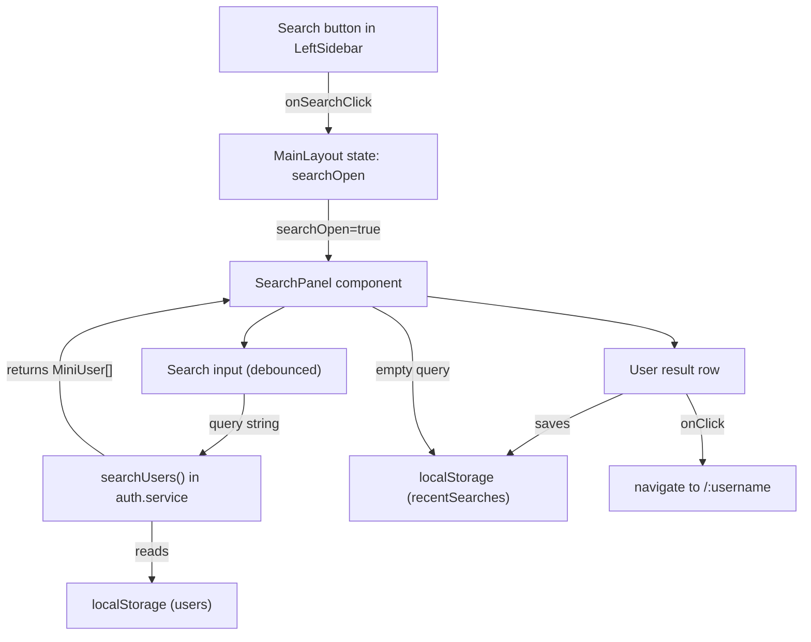

# Search

## Context

The left sidebar ([LeftSidebar.tsx](../src/components/layout/LeftSidebar.tsx), lines 25-28) already has a Search button, but it is a no-op:

```tsx
<button className="nav-item" type="button">
  <Search size={24} />
  <span className="nav-label">Search</span>
</button>
```

The data to power search already exists in localStorage:
- **Users** -- `getUsers()` in [auth.service.ts](../src/services/auth.service.ts) returns all `User` objects, each with `username`, `fullname`, `imgUrl`, and `bio`
- **User type** -- [user.types.ts](../src/types/user.types.ts) has `MiniUser` (lightweight) and `User` (full)

The app uses the same slide-out/modal pattern for other features: `CreatePostModal` is managed via state in [MainLayout.tsx](../src/components/layout/MainLayout.tsx) and toggled from `LeftSidebar` via a callback prop.

---

## Questions

1. **UI style** -- This plan assumes an Instagram-style slide-out panel (clicking Search narrows the sidebar to icon-only and slides out a search panel to its right). Alternative: a separate `/search` page route. **Which approach do you prefer?** instgram style

2. **Search scope** -- Posts have a `tags?: string[]` field. Should search cover users only (username + fullname), or also surface hashtag results from post tags? **This plan defaults to users-only; confirm or request hashtags too.** do what you think is best

---

## 1. Architecture



When `searchOpen` is true, the sidebar collapses to narrow mode (icon-only) and the `SearchPanel` slides in from the left, positioned right next to the narrow sidebar. Clicking outside or pressing Escape closes the panel.

---

## 2. Service function -- `searchUsers`

Add to [auth.service.ts](../src/services/auth.service.ts):

```ts
export function searchUsers(query: string): MiniUser[] {
  if (!query.trim()) return []

  const term = query.toLowerCase()
  return getUsers()
    .filter(u =>
      u.username.toLowerCase().includes(term) ||
      u.fullname.toLowerCase().includes(term)
    )
    .map(u => ({ _id: u._id, username: u.username, fullname: u.fullname, imgUrl: u.imgUrl }))
}
```

Follows the existing service pattern -- reads all users from localStorage, filters, returns `MiniUser[]`. Case-insensitive substring match on both `username` and `fullname`.

---

## 3. Recent searches -- localStorage persistence

Add two helper functions to [auth.service.ts](../src/services/auth.service.ts):

```ts
const RECENT_SEARCHES_KEY = 'recentSearches'
const MAX_RECENT = 10

export function getRecentSearches(): MiniUser[] {
  try {
    const stored = localStorage.getItem(RECENT_SEARCHES_KEY)
    if (stored) return JSON.parse(stored)
  } catch { /* restricted storage */ }
  return []
}

export function addRecentSearch(user: MiniUser): void {
  const recent = getRecentSearches().filter(u => u._id !== user._id)
  recent.unshift(user)
  if (recent.length > MAX_RECENT) recent.pop()
  try {
    localStorage.setItem(RECENT_SEARCHES_KEY, JSON.stringify(recent))
  } catch { /* restricted storage */ }
}

export function removeRecentSearch(userId: string): void {
  const recent = getRecentSearches().filter(u => u._id !== userId)
  try {
    localStorage.setItem(RECENT_SEARCHES_KEY, JSON.stringify(recent))
  } catch { /* restricted storage */ }
}

export function clearRecentSearches(): void {
  try {
    localStorage.removeItem(RECENT_SEARCHES_KEY)
  } catch { /* restricted storage */ }
}
```

These follow the same localStorage try/catch pattern used throughout the service layer.

---

## 4. SearchPanel component

Create [SearchPanel.tsx](../src/components/ui/SearchPanel.tsx):

- **Props**: `onClose: () => void`
- **State**: `query` (string), `results` (MiniUser[]), `recentSearches` (MiniUser[])
- **Behavior**:
  - On mount, load recent searches via `getRecentSearches()`
  - As the user types, call `searchUsers(query)` (no debounce needed -- localStorage reads are synchronous and fast with ~7 users)
  - When `query` is empty, show the "Recent" section with recent searches
  - When `query` has text, show matching results
  - Clicking a result: call `addRecentSearch(user)`, navigate to `/${user.username}`, call `onClose()`
  - Each recent search row has an X button that calls `removeRecentSearch(userId)` and updates local state
  - "Clear all" link at the top of the recent section calls `clearRecentSearches()`
  - Pressing Escape calls `onClose()`

### Component structure:

```tsx
<aside className="search-panel">
  <header className="search-panel-header">
    <h2>Search</h2>
  </header>

  <div className="search-panel-input-wrapper">
    <Search size={16} />
    <input
      type="text"
      placeholder="Search"
      value={query}
      onChange={e => setQuery(e.target.value)}
      autoFocus
    />
    {query && (
      <button className="search-clear-btn" onClick={() => setQuery('')}>
        <X size={16} />
      </button>
    )}
  </div>

  <div className="search-panel-divider" />

  {query ? (
    <ul className="search-results">
      {results.map(user => (
        <li key={user._id}>
          <button className="search-result-row" onClick={() => onSelectUser(user)}>
            
            <div>
              <span className="username">{user.username}</span>
              <span className="fullname">{user.fullname}</span>
            </div>
          </button>
        </li>
      ))}
      {results.length === 0 && <li className="search-no-results">No results found.</li>}
    </ul>
  ) : (
    <div className="search-recent">
      <div className="search-recent-header">
        <span>Recent</span>
        {recentSearches.length > 0 && (
          <button onClick={onClearAll}>Clear all</button>
        )}
      </div>
      <ul className="search-results">
        {recentSearches.map(user => (
          <li key={user._id}>
            <button className="search-result-row" onClick={() => onSelectUser(user)}>
              
              <div>
                <span className="username">{user.username}</span>
                <span className="fullname">{user.fullname}</span>
              </div>
            </button>
            <button className="search-remove-btn" onClick={() => onRemoveRecent(user._id)}>
              <X size={16} />
            </button>
          </li>
        ))}
        {recentSearches.length === 0 && (
          <li className="search-no-results">No recent searches.</li>
        )}
      </ul>
    </div>
  )}
</aside>
```

Uses `useNavigate` from React Router to navigate on result click.

---

## 5. MainLayout changes

In [MainLayout.tsx](../src/components/layout/MainLayout.tsx):

- Add `searchOpen` state (`useState(false)`)
- Pass `onSearchClick={() => setSearchOpen(true)}` and `searchOpen` to `LeftSidebar`
- Render `SearchPanel` when `searchOpen` is true, with `onClose={() => setSearchOpen(false)}`
- Add a backdrop overlay when the panel is open (clicking it closes the panel)
- Add `search-open` class to `.app-layout` when panel is open (used for sidebar narrowing)

```tsx
return (
  <div className={`app-layout${searchOpen ? ' search-open' : ''}`}>
    <LeftSidebar
      onCreateClick={() => setCreateModalOpen(true)}
      onSearchClick={() => setSearchOpen(true)}
      searchOpen={searchOpen}
    />
    <main className="main-content">
      <Outlet context={{ registerPostCreated } satisfies OutletContext} />
    </main>
    {searchOpen && (
      <>
        <SearchPanel onClose={() => setSearchOpen(false)} />
        <div className="search-backdrop" onClick={() => setSearchOpen(false)} />
      </>
    )}
    {createModalOpen && miniUser && (
      <CreatePostModal ... />
    )}
  </div>
)
```

---

## 6. LeftSidebar changes

In [LeftSidebar.tsx](../src/components/layout/LeftSidebar.tsx):

- Accept new props: `onSearchClick?: () => void` and `searchOpen?: boolean`
- Wire the Search button's `onClick` to `onSearchClick`
- When `searchOpen` is true, add an `active` class to the Search button to highlight it

```tsx
<button
  className={`nav-item${searchOpen ? ' active' : ''}`}
  type="button"
  onClick={onSearchClick}
>
  <Search size={24} />
  <span className="nav-label">Search</span>
</button>
```

---

## 7. CSS

### 7a. SearchPanel.css

Create [SearchPanel.css](../src/style/cmps/SearchPanel.css):

```css
.search-panel {
  position: fixed;
  inset-block: 0;
  inset-inline-start: var(--sidebar-width-narrow);
  width: 24rem;
  background: var(--clr-bg);
  border-inline-end: 1px solid var(--clr-border);
  border-start-end-radius: var(--radius-lg);
  border-end-end-radius: var(--radius-lg);
  z-index: 99;
  display: flex;
  flex-direction: column;
  animation: slideInSearch var(--transition-normal) forwards;
  box-shadow: 4px 0 24px rgba(0, 0, 0, 0.15);
}

@keyframes slideInSearch {
  from { transform: translateX(-100%); opacity: 0; }
  to   { transform: translateX(0);     opacity: 1; }
}

.search-panel-header {
  padding: var(--spacing-lg) var(--spacing-lg) var(--spacing-md);

  h2 {
    font-size: 1.5rem;
    font-weight: 600;
  }
}

.search-panel-input-wrapper {
  display: flex;
  align-items: center;
  gap: var(--spacing-sm);
  margin: 0 var(--spacing-lg);
  padding: var(--spacing-sm) var(--spacing-md);
  background: var(--clr-bg-elevated);
  border: 1px solid var(--clr-border);
  border-radius: var(--radius-md);

  input {
    flex: 1;
    background: none;
    border: none;
    color: var(--clr-text);
    font-size: 0.9375rem;
    outline: none;

    &::placeholder {
      color: var(--clr-text-subtle);
    }
  }
}

.search-clear-btn {
  color: var(--clr-text-muted);
  cursor: pointer;

  &:hover {
    color: var(--clr-text);
  }
}

.search-panel-divider {
  height: 1px;
  background: var(--clr-border);
  margin-block: var(--spacing-lg);
}

.search-recent-header {
  display: flex;
  justify-content: space-between;
  align-items: center;
  padding: 0 var(--spacing-lg) var(--spacing-md);
  font-weight: 600;

  button {
    color: var(--clr-accent);
    font-size: 0.875rem;
    font-weight: 600;
    cursor: pointer;

    &:hover {
      color: var(--clr-accent-hover);
    }
  }
}

.search-results {
  flex: 1;
  overflow-y: auto;
  list-style: none;

  li {
    display: flex;
    align-items: center;
  }
}

.search-result-row {
  display: flex;
  align-items: center;
  gap: var(--spacing-md);
  padding: var(--spacing-sm) var(--spacing-lg);
  width: 100%;
  text-align: start;
  cursor: pointer;
  transition: background var(--transition-fast);

  &:hover {
    background: var(--clr-btn-hover-bg);
  }

  div {
    display: flex;
    flex-direction: column;
  }

  .username {
    font-size: 0.875rem;
    font-weight: 600;
    color: var(--clr-text);
  }

  .fullname {
    font-size: 0.8125rem;
    color: var(--clr-text-muted);
  }
}

.search-remove-btn {
  margin-inline-start: auto;
  padding: var(--spacing-sm);
  color: var(--clr-text-subtle);
  cursor: pointer;

  &:hover {
    color: var(--clr-text);
  }
}

.search-no-results {
  padding: var(--spacing-xl) var(--spacing-lg);
  color: var(--clr-text-muted);
  text-align: center;
  font-size: 0.875rem;
}

.search-backdrop {
  position: fixed;
  inset: 0;
  z-index: 98;
}
```

### 7b. LeftSidebar.css -- sidebar narrowing when search is open

Add to [LeftSidebar.css](../src/style/cmps/LeftSidebar.css):

```css
.search-open .left-sidebar {
  width: var(--sidebar-width-narrow);
  align-items: center;
  padding: var(--spacing-lg) var(--spacing-sm);

  .sidebar-logo {
    .logo-full { display: none; }
    .logo-icon { display: block; }
  }

  .nav-label { display: none; }

  .nav-item {
    justify-content: center;
    padding: var(--spacing-sm);
  }
}
```

This reuses the same narrow styling already applied at the `max-width: 1264px` breakpoint.

### 7c. main.css -- import

Add to [main.css](../src/style/main.css):

```css
@import './cmps/SearchPanel.css';
```

---

## 8. Edge cases

- **Self in results** -- The logged-in user can appear in search results (Instagram allows searching yourself). No filtering needed.
- **Empty query** -- Shows recent searches. If no recent searches exist, shows a "No recent searches" message.
- **No matches** -- Shows "No results found." when the query returns zero results.
- **Navigation closes panel** -- Clicking a result navigates to the profile and closes the panel via `onClose()`.
- **Escape key** -- Pressing Escape closes the panel. Handled via a `useEffect` with a `keydown` listener in `SearchPanel`.
- **Responsive** -- On narrow viewports (<=1264px), the sidebar is already in icon-only mode, so the panel simply slides in from the narrow sidebar's right edge. No extra responsive handling needed.
- **Backdrop** -- A transparent backdrop behind the panel catches clicks outside to close. It sits at `z-index: 98` (below the panel at 99, below the sidebar at 100).
