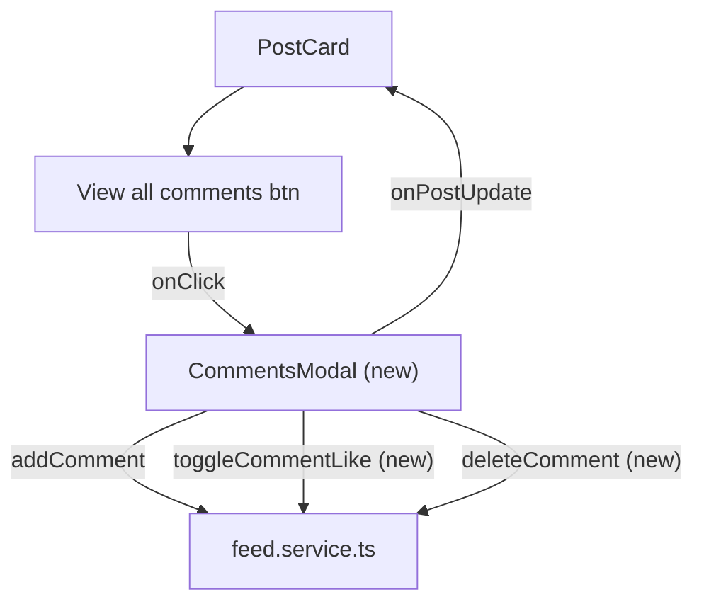

# View All Comments Modal

## Context

The [PostCard.tsx](../src/components/ui/PostCard.tsx) already renders a "View all {count} comments" button (line 109) when `post.comments.count > 2`, but the button has no `onClick` handler. Two comments are always shown inline, and an inline form at the bottom lets users add new comments via `addComment()` from [feed.service.ts](../src/services/feed.service.ts).

The `Comment` type ([post.types.ts](../src/types/post.types.ts)) has `_id`, `txt`, `by` (MiniUser), `createdAt`, and an optional `likedBy` array. Comments live inside the `Post` object as `{ count, list }` and are persisted via localStorage.

The project already has two portal-based modals -- [StoryViewer.tsx](../src/components/ui/StoryViewer.tsx) and [CreatePostModal.tsx](../src/components/ui/CreatePostModal.tsx) -- both using `createPortal`, Escape key handling, body scroll lock, and backdrop click to close.

---

## Answers

| Q | Choice | Summary |
|---|--------|---------|
| Q1 | **a** | Instagram-style side panel -- image left, comments right, stacks on mobile |
| Q2 | **b** | Like a comment + delete own comments |
| Q3 | **a** | Sticky comment input at bottom of modal |
| Q4 | **a** | Only the "View all X comments" button opens modal |
| Q5 | **a** | Real-time updates -- modal fires `onPostUpdate` so PostCard re-renders immediately |
| Q6 | **a** | `src/components/ui/CommentsModal.tsx` |

---

## 1. Architecture



---

## 2. New service functions in feed.service.ts

Two new functions needed in [feed.service.ts](../src/services/feed.service.ts):

### toggleCommentLike

```ts
export function toggleCommentLike(postId: string, commentId: string, user: MiniUser): Post | undefined {
  const posts = getPosts()
  const post = posts.find(p => p._id === postId)
  if (!post) return undefined

  const comment = post.comments.list.find(c => c._id === commentId)
  if (!comment) return undefined

  if (!comment.likedBy) comment.likedBy = []
  const idx = comment.likedBy.findIndex(u => u._id === user._id)
  if (idx >= 0) {
    comment.likedBy.splice(idx, 1)
  } else {
    comment.likedBy.push(user)
  }
  _savePosts(posts)
  return post
}
```

### deleteComment

```ts
export function deleteComment(postId: string, commentId: string): Post | undefined {
  const posts = getPosts()
  const post = posts.find(p => p._id === postId)
  if (!post) return undefined

  const idx = post.comments.list.findIndex(c => c._id === commentId)
  if (idx < 0) return undefined

  post.comments.list.splice(idx, 1)
  post.comments.count--
  _savePosts(posts)
  return post
}
```

---

## 3. New component -- CommentsModal

File: `src/components/ui/CommentsModal.tsx`

### Props

```ts
interface Props {
  post: Post
  currentUser: MiniUser
  onClose: () => void
  onPostUpdate: (post: Post) => void
}
```

### Layout -- Instagram-style side panel

```
+-----------------------------------------------------------+
|  X (close)                                                 |
+---------------------------+-------------------------------+
|                           |  avatar  username   time ago   |
|                           |  caption text                  |
|    Post Image             |  ---                           |
|    (object-fit: cover)    |  avatar  user1  comment txt  ♡ |
|    (aspect-ratio: 1)      |  avatar  user2  comment txt  ♡ |
|                           |        (scrollable area)       |
|                           |  avatar  user3  comment txt  🗑♡|
|                           +-------------------------------+
|                           |  ♡  Add a comment...   [Post]  |
+---------------------------+-------------------------------+
```

- **Left half:** Post image, `object-fit: cover`, full height of the modal
- **Right half:** Vertically split into three sections:
  - **Top:** Post author info (avatar, username, time) + caption
  - **Middle:** Scrollable comments list (`overflow-y: auto`, `flex: 1`)
  - **Bottom:** Sticky comment form (same input pattern as PostCard)
- **Mobile (< 640px):** Stacks vertically -- image on top (limited height), comments below

### Comment item

Each comment renders:
- Avatar (small, linked to profile)
- Username (linked to profile)
- Comment text
- `timeAgo(createdAt)` in muted text
- Heart icon button (filled red if liked by `currentUser`, shows like count if > 0)
- Trash icon button (only visible if `comment.by._id === currentUser._id`)

### Behavior

- Renders via `createPortal` to `document.body`
- `Escape` key and backdrop click close the modal
- Body scroll locked while open (`document.body.style.overflow = 'hidden'`)
- Manages local `comments` state initialized from `post.comments.list`
- **Add comment:** calls `addComment()`, appends to local list, increments count, fires `onPostUpdate`
- **Like comment:** calls `toggleCommentLike()`, updates local list, fires `onPostUpdate`
- **Delete comment:** calls `deleteComment()`, removes from local list, decrements count, fires `onPostUpdate`
- Comment input auto-focused on mount
- Scroll to bottom when a new comment is added

---

## 4. CSS -- CommentsModal.css

File: `src/style/cmps/CommentsModal.css`

Key rules:

- **Overlay:** `position: fixed; inset: 0; z-index: 1000; background: rgba(0, 0, 0, 0.65);` with flex centering (same pattern as CreatePostModal)
- **Modal card:** `max-width: 900px; max-height: 85vh; width: 95vw;` with `--clr-bg-elevated` background, `--radius-lg` border radius, `overflow: hidden`
- **Split layout:** `display: flex;` -- left image panel 45% width, right comments panel 55% width
- **Image panel:** `aspect-ratio: 1; object-fit: cover; max-height: 85vh`
- **Comments panel:** `display: flex; flex-direction: column;` so header/list/input stack vertically
- **Comments list:** `flex: 1; overflow-y: auto; padding: var(--spacing-md);`
- **Comment item:** flex row with gap, border-bottom separator, hover state for action icons
- **Comment actions:** Heart and trash icons, `opacity: 0` on rest, `opacity: 1` on comment hover (trash only shown for own comments)
- **Sticky input:** `border-block-start: 1px solid var(--clr-border); padding: var(--spacing-sm) var(--spacing-md);` pinned to bottom
- **Close button:** absolute top-right on overlay, white X icon (Lucide `X`)
- **Responsive (< 640px):** `flex-direction: column;` image gets `max-height: 240px`, comments panel gets remaining space
- **Like animation:** reuse `like-pop` keyframes from PostCard

---

## 5. Changes to existing files

### PostCard.tsx

- Add state: `commentsModalOpen` (boolean)
- Wire `onClick` on the "View all {count} comments" button to set `commentsModalOpen = true`
- Render `CommentsModal` when `commentsModalOpen` is true, passing `post`, `currentUser`, `onClose`, and `onPostUpdate`

### main.css

- Add `@import './cmps/CommentsModal.css'` after the CreatePostModal import

---

## 6. Keyboard and accessibility

- `Escape` closes modal
- Comment input auto-focused on open via `useRef` + `useEffect`
- Close button has `aria-label="Close comments"`
- Comments list uses semantic markup (`<ul>` / `<li>`)
- Like button has `aria-label="Like comment"` / `"Unlike comment"`
- Delete button has `aria-label="Delete comment"`

---

## 7. File summary

| Action | File |
|--------|------|
| **New** | `src/components/ui/CommentsModal.tsx` |
| **New** | `src/style/cmps/CommentsModal.css` |
| **Edit** | `src/services/feed.service.ts` (add `toggleCommentLike`, `deleteComment`) |
| **Edit** | `src/components/ui/PostCard.tsx` (add modal state + trigger) |
| **Edit** | `src/style/main.css` (add CSS import) |
