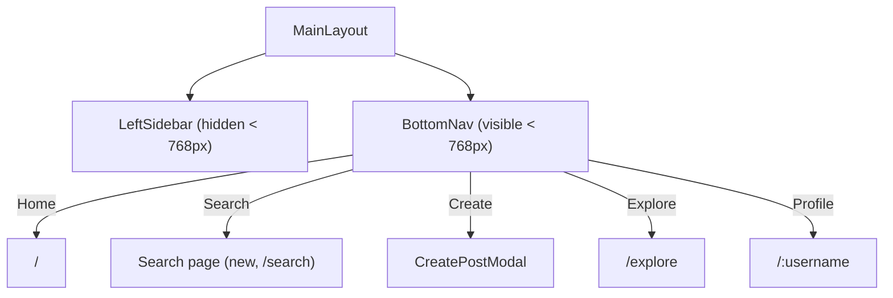

# Mobile Bottom Navigation

## Context

The app currently uses a fixed [LeftSidebar.tsx](../src/components/layout/LeftSidebar.tsx) for all navigation. On screens narrower than `1264px` the sidebar collapses to icon-only mode (`--sidebar-width-narrow: 4.5rem`), but it never fully hides — meaning on phones the sidebar still eats horizontal space and doesn't follow the mobile UX pattern users expect.

The sidebar contains these nav items: **Home**, **Search** (opens SearchPanel), **Explore**, **Notifications** (stub), **Create** (opens CreatePostModal), **Profile**, **More** (stub), and a **ThemeToggle** in the footer.

The layout is defined in [MainLayout.tsx](../src/components/layout/MainLayout.tsx) and styled via [layout.css](../src/style/basics/layout.css) (`.app-layout` flex container) and [LeftSidebar.css](../src/style/cmps/LeftSidebar.css). The `main-content` area has `margin-inline-start: var(--sidebar-width-narrow)` at `max-width: 1264px`.

Icons come from **Lucide React**. CSS uses custom properties, component files imported into [main.css](../src/style/main.css), and logical properties throughout.

---

## Answers

| Q | Choice | Summary |
|---|--------|---------|
| Q1 | **a** | `768px` breakpoint — sidebar on tablet+, bottom nav on phone |
| Q2 | **a** | 5 items — Home, Search, Create (+), Explore, Profile |
| Q3 | **a** | Search → dedicated `/search` page on mobile; Create → existing modal |
| Q4 | **a** | Completely hide sidebar below `768px`, `margin-inline-start: 0` |
| Q5 | **a** | Filled icon for active item (Instagram-style) |
| Q6 | **a** | Icons only, no text labels |
| Q7 | **a** | Auto-hide on scroll down, reveal on scroll up |
| Q8 | **a** | `src/components/layout/BottomNav.tsx` |

---

## 1. Architecture



Visibility is **CSS-only** — no JS media-query listeners. Both components render in the DOM; CSS hides one and shows the other at `768px`.

---

## 2. New component — BottomNav

File: `src/components/layout/BottomNav.tsx`

### Props

```ts
interface Props {
  onCreateClick: () => void
}
```

### Nav items (order: left → right)

| # | Label | Icon (outline) | Icon (active/filled) | Target |
|---|-------|---------------|---------------------|--------|
| 1 | Home | `Home` | **`Home`** (stroke-width 2.5) | `NavLink to="/" end` |
| 2 | Search | `Search` | **`Search`** (stroke-width 2.5) | `NavLink to="/search"` |
| 3 | Create | `PlusSquare` | — (never "active") | `button onClick={onCreateClick}` |
| 4 | Explore | `Compass` | **`Compass`** (stroke-width 2.5) | `NavLink to="/explore"` |
| 5 | Profile | user avatar | avatar with border | `NavLink to="/:username"` |

Lucide doesn't ship separate filled variants, so the "filled" look is achieved by bumping `strokeWidth` to `2.5` on the active icon. For the Profile item, the avatar gets a `2px solid var(--clr-text)` border when active.

### Scroll hide/show behavior

A custom hook (`useScrollDirection`) tracks scroll direction:

```ts
function useScrollDirection(threshold = 10) {
  const [hidden, setHidden] = useState(false)
  const lastScrollY = useRef(0)

  useEffect(() => {
    function onScroll() {
      const currentY = window.scrollY
      if (Math.abs(currentY - lastScrollY.current) < threshold) return
      setHidden(currentY > lastScrollY.current && currentY > 50)
      lastScrollY.current = currentY
    }
    window.addEventListener('scroll', onScroll, { passive: true })
    return () => window.removeEventListener('scroll', onScroll)
  }, [threshold])

  return hidden
}
```

When `hidden` is true, the nav translates down off-screen via `transform: translateY(100%)`.

### Component structure

```tsx
export function BottomNav({ onCreateClick }: Props) {
  const user = useAuthStore(s => s.user)
  const hidden = useScrollDirection()

  return (
    <nav className={`bottom-nav${hidden ? ' hidden' : ''}`}>
      <NavLink to="/" end className="bottom-nav-item">
        {({ isActive }) => <Home size={24} strokeWidth={isActive ? 2.5 : 1.5} />}
      </NavLink>
      <NavLink to="/search" className="bottom-nav-item">
        {({ isActive }) => <Search size={24} strokeWidth={isActive ? 2.5 : 1.5} />}
      </NavLink>
      <button className="bottom-nav-item" type="button" onClick={onCreateClick}>
        <PlusSquare size={24} strokeWidth={1.5} />
      </button>
      <NavLink to="/explore" className="bottom-nav-item">
        {({ isActive }) => <Compass size={24} strokeWidth={isActive ? 2.5 : 1.5} />}
      </NavLink>
      {user && (
        <NavLink to={`/${user.username}`} className="bottom-nav-item">
          
        </NavLink>
      )}
    </nav>
  )
}
```

---

## 3. New page — Search (mobile)

File: `src/pages/Search.tsx`

A thin wrapper that renders the existing search UI (`SearchPanel` internals) as a full page instead of a slide-in panel. It reuses the same search logic from [SearchPanel.tsx](../src/components/ui/SearchPanel.tsx):

- Full-width search input at top
- Recent searches section
- Live search results list
- Tapping a result navigates to the user profile and the page unmounts naturally

### Route addition in App.tsx

```tsx
<Route path="search" element={<Search />} />
```

---

## 4. CSS — BottomNav.css

File: `src/style/cmps/BottomNav.css`

### Key rules

```css
.bottom-nav {
  display: none;                        /* hidden on desktop */
  position: fixed;
  inset-inline: 0;
  bottom: 0;
  z-index: 100;
  height: 3rem;
  background: var(--clr-bg);
  border-block-start: 1px solid var(--clr-border);
  transition: transform var(--transition-normal);
}

.bottom-nav.hidden {
  transform: translateY(100%);
}

.bottom-nav-item {
  flex: 1;
  display: flex;
  align-items: center;
  justify-content: center;
  color: var(--clr-text);
  padding: var(--spacing-sm) 0;
}

.bottom-nav-item.active {
  color: var(--clr-text);               /* stays same color, thicker stroke handles active */
}

.bottom-nav-avatar {
  width: 1.5rem;
  height: 1.5rem;
  border-radius: var(--radius-round);
  object-fit: cover;
  border: 2px solid transparent;
}

.active .bottom-nav-avatar {
  border-color: var(--clr-text);
}

@media (max-width: 768px) {
  .bottom-nav {
    display: flex;
  }
}
```

---

## 5. CSS changes — hide sidebar & fix layout on mobile

### LeftSidebar.css — add at the end

```css
@media (max-width: 768px) {
  .left-sidebar {
    display: none;
  }
}
```

### layout.css — add at the end

```css
@media (max-width: 768px) {
  .main-content {
    margin-inline-start: 0;
    padding-block-end: 3.5rem;    /* space for bottom nav so content isn't hidden behind it */
  }
}
```

`padding-block-end: 3.5rem` ensures the last content isn't hidden behind the fixed bottom nav (nav height `3rem` + `0.5rem` breathing room).

---

## 6. Changes to existing files

### MainLayout.tsx

- Import `BottomNav`
- Render `<BottomNav onCreateClick={() => setCreateModalOpen(true)} />` inside the `app-layout` div, after `<main>`

```tsx
<div className={`app-layout${searchOpen ? ' search-open' : ''}`}>
  <LeftSidebar ... />
  <main className="main-content">
    <Outlet ... />
  </main>
  <BottomNav onCreateClick={() => setCreateModalOpen(true)} />
  {/* SearchPanel, CreatePostModal, etc. */}
</div>
```

### App.tsx

- Import `Search` page
- Add route: `<Route path="search" element={<Search />} />`

### main.css

- Add `@import './cmps/BottomNav.css';` after the LeftSidebar import

---

## 7. Safe-area handling (notch / home indicator)

For devices with a home indicator (iPhone X+), the bottom nav should respect `env(safe-area-inset-bottom)`:

```css
@media (max-width: 768px) {
  .bottom-nav {
    padding-block-end: env(safe-area-inset-bottom, 0);
  }
}
```

And the `<meta name="viewport">` in `index.html` should include `viewport-fit=cover` if not already present.

---

## 8. File summary

| Action | File |
|--------|------|
| **New** | `src/components/layout/BottomNav.tsx` |
| **New** | `src/style/cmps/BottomNav.css` |
| **New** | `src/pages/Search.tsx` |
| **Edit** | `src/components/layout/MainLayout.tsx` (render BottomNav) |
| **Edit** | `src/App.tsx` (add `/search` route) |
| **Edit** | `src/style/cmps/LeftSidebar.css` (hide at 768px) |
| **Edit** | `src/style/basics/layout.css` (remove margin + add bottom padding at 768px) |
| **Edit** | `src/style/main.css` (add BottomNav.css import) |
