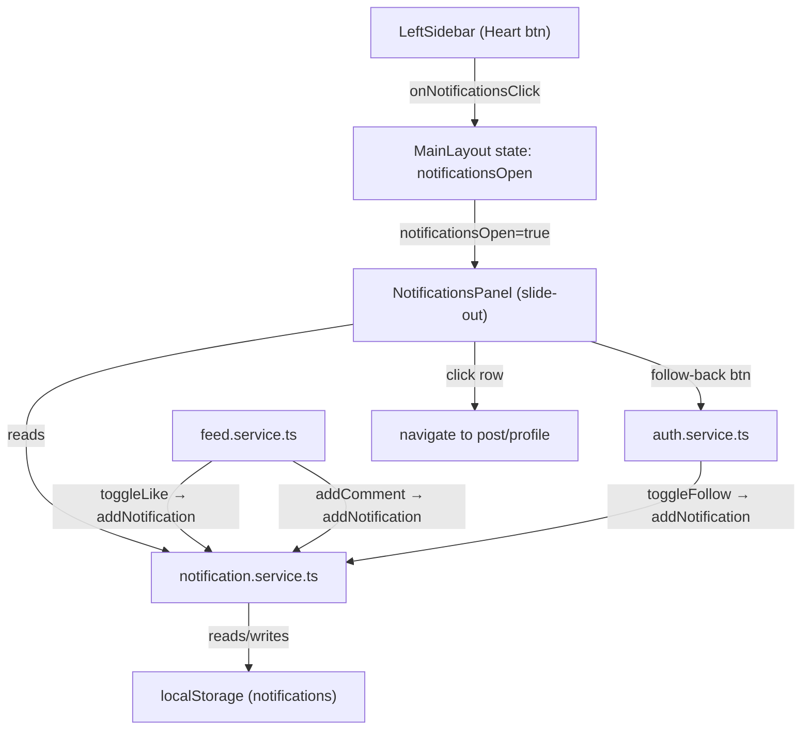

# Notifications

## Context

The [LeftSidebar.tsx](../src/components/layout/LeftSidebar.tsx) has a Notifications button (line 39-42) that is currently a no-op stub:

```tsx
<button className="nav-item" type="button">
  <Heart size={24} />
  <span className="nav-label">Notifications</span>
</button>
```

The app already has several user actions that would naturally generate notifications:
- **Like a post** — `toggleLike()` in [feed.service.ts](../src/services/feed.service.ts)
- **Comment on a post** — `addComment()` in feed.service.ts
- **Follow a user** — `toggleFollow()` in [auth.service.ts](../src/services/auth.service.ts)

Data is persisted in localStorage. The existing slide-out pattern (SearchPanel) and modal pattern (CommentsModal, CreatePostModal) are well established.

---

## Answers

| Q | Choice | Summary |
|---|--------|---------|
| Q1 | **a** | Slide-out panel (Instagram-style), same pattern as SearchPanel |
| Q2 | **b** | Three — likes, comments, follows (skip comment likes) |
| Q3 | **a** | Grouped — "user1, user2, and 3 others liked your post" |
| Q4 | **a** | Navigate to relevant content — post for likes/comments, profile for follows |
| Q5 | **a** | Red dot on Heart icon for unread |
| Q6 | **a** | Yes — post thumbnail on the right for like/comment notifications |
| Q7 | **a** | Yes — inline Follow/Following button on follow notifications |
| Q8 | **a** | Yes — seed mock notifications on first load |
| Q9 | **a** | Navigate to `/notifications` page on mobile |
| Q10 | **a** | `src/components/ui/NotificationsPanel.tsx` |

---

## 1. Architecture



When `notificationsOpen` is true, the sidebar collapses to narrow mode (same as search) and the `NotificationsPanel` slides in from the left. Clicking outside or pressing Escape closes the panel. Only one panel can be open at a time (search or notifications).

---

## 2. Notification types — `notification.types.ts`

File: `src/types/notification.types.ts`

```ts
import type { MiniUser } from './user.types'

export type NotificationType = 'like' | 'comment' | 'follow'

export interface Notification {
  _id: string
  type: NotificationType
  by: MiniUser
  targetUserId: string
  postId?: string
  postImgUrl?: string
  commentTxt?: string
  createdAt: string
  isRead: boolean
}

export interface GroupedNotification {
  type: NotificationType
  postId?: string
  postImgUrl?: string
  commentTxt?: string
  users: MiniUser[]
  latestAt: string
  isRead: boolean
  ids: string[]
}
```

- `targetUserId` — the user who receives the notification (always the logged-in user for display purposes, but stored for filtering)
- `postId` + `postImgUrl` — present for `like` and `comment` types, used for navigation and thumbnail
- `commentTxt` — present for `comment` type, shows what was commented
- `GroupedNotification` — derived at read time, not stored; groups notifications by `type` + `postId`

---

## 3. Service layer — `notification.service.ts`

File: `src/services/notification.service.ts`

### Storage

```ts
const NOTIFICATIONS_KEY = 'notifications'
```

### Core functions

```ts
export function getNotifications(): Notification[] {
  try {
    const stored = localStorage.getItem(NOTIFICATIONS_KEY)
    if (stored) return JSON.parse(stored)
  } catch { /* restricted storage */ }
  return []
}

function _saveNotifications(notifications: Notification[]): void {
  try {
    localStorage.setItem(NOTIFICATIONS_KEY, JSON.stringify(notifications))
  } catch { /* restricted storage */ }
}

export function addNotification(notification: Omit<Notification, '_id' | 'createdAt' | 'isRead'>): Notification {
  const notifications = getNotifications()
  const newNotif: Notification = {
    ...notification,
    _id: `n${makeId(6)}`,
    createdAt: new Date().toISOString(),
    isRead: false,
  }
  notifications.unshift(newNotif)
  _saveNotifications(notifications)
  return newNotif
}

export function removeNotification(type: NotificationType, byUserId: string, postId?: string): void {
  const notifications = getNotifications()
  const filtered = notifications.filter(n => {
    if (n.type !== type || n.by._id !== byUserId) return true
    if (type === 'follow') return false
    return n.postId !== postId
  })
  _saveNotifications(filtered)
}
```

`removeNotification` is called when an action is undone (unlike, unfollow) to clean up the notification.

### Grouping function

```ts
export function getGroupedNotifications(userId: string): GroupedNotification[] {
  const notifications = getNotifications()
    .filter(n => n.targetUserId === userId)
    .sort((a, b) => new Date(b.createdAt).getTime() - new Date(a.createdAt).getTime())

  const groups: GroupedNotification[] = []
  const groupMap = new Map<string, GroupedNotification>()

  for (const n of notifications) {
    const key = n.type === 'follow'
      ? `follow`
      : `${n.type}-${n.postId}`

    // Don't group follow notifications — each follow is its own row
    // (to show individual follow-back buttons)
    if (n.type === 'follow') {
      groups.push({
        type: 'follow',
        users: [n.by],
        latestAt: n.createdAt,
        isRead: n.isRead,
        ids: [n._id],
      })
      continue
    }

    const existing = groupMap.get(key)
    if (existing) {
      if (!existing.users.some(u => u._id === n.by._id)) {
        existing.users.push(n.by)
      }
      existing.ids.push(n._id)
      if (!n.isRead) existing.isRead = false
    } else {
      const group: GroupedNotification = {
        type: n.type,
        postId: n.postId,
        postImgUrl: n.postImgUrl,
        commentTxt: n.commentTxt,
        users: [n.by],
        latestAt: n.createdAt,
        isRead: n.isRead,
        ids: [n._id],
      }
      groupMap.set(key, group)
      groups.push(group)
    }
  }

  return groups
}
```

Likes on the same post group together ("user1, user2, and 3 others liked your post"). Comments on the same post group together. Follow notifications stay individual (so each has its own follow-back button).

### Read status

```ts
export function markAllAsRead(userId: string): void {
  const notifications = getNotifications()
  let changed = false
  for (const n of notifications) {
    if (n.targetUserId === userId && !n.isRead) {
      n.isRead = true
      changed = true
    }
  }
  if (changed) _saveNotifications(notifications)
}

export function hasUnread(userId: string): boolean {
  return getNotifications().some(n => n.targetUserId === userId && !n.isRead)
}
```

### Seed data

```ts
export function seedNotificationsIfNeeded(targetUserId: string): void {
  const existing = getNotifications()
  if (existing.length > 0) return

  const users = getUsers()
  const posts = getPosts().filter(p => p.by._id === targetUserId)
  const otherUsers = users.filter(u => u._id !== targetUserId)

  if (otherUsers.length === 0 || posts.length === 0) return

  const seed: Notification[] = []
  const now = Date.now()

  // Likes on user's posts from various users
  for (let i = 0; i < Math.min(3, posts.length); i++) {
    const post = posts[i]
    for (let j = 0; j < Math.min(2, otherUsers.length); j++) {
      seed.push({
        _id: `n${makeId(6)}`,
        type: 'like',
        by: { _id: otherUsers[j]._id, username: otherUsers[j].username, fullname: otherUsers[j].fullname, imgUrl: otherUsers[j].imgUrl },
        targetUserId,
        postId: post._id,
        postImgUrl: post.imgUrl,
        createdAt: new Date(now - (i * 2 + j) * 3600000).toISOString(),
        isRead: false,
      })
    }
  }

  // Comments on user's posts
  if (posts.length > 0 && otherUsers.length > 0) {
    seed.push({
      _id: `n${makeId(6)}`,
      type: 'comment',
      by: { _id: otherUsers[0]._id, username: otherUsers[0].username, fullname: otherUsers[0].fullname, imgUrl: otherUsers[0].imgUrl },
      targetUserId,
      postId: posts[0]._id,
      postImgUrl: posts[0].imgUrl,
      commentTxt: 'This is amazing! 🔥',
      createdAt: new Date(now - 1800000).toISOString(),
      isRead: false,
    })
  }

  // Follow notifications
  for (let i = 0; i < Math.min(2, otherUsers.length); i++) {
    seed.push({
      _id: `n${makeId(6)}`,
      type: 'follow',
      by: { _id: otherUsers[i]._id, username: otherUsers[i].username, fullname: otherUsers[i].fullname, imgUrl: otherUsers[i].imgUrl },
      targetUserId,
      createdAt: new Date(now - (i + 1) * 7200000).toISOString(),
      isRead: false,
    })
  }

  _saveNotifications(seed)
}
```

Called once during app init (in `auth.store` or `App.tsx`), only populates if localStorage is empty.

---

## 4. Hooking into existing service functions

### feed.service.ts — `toggleLike`

After the like is toggled, if the action is a **like** (not unlike) and the post author is not the current user, call `addNotification`:

```ts
import { addNotification, removeNotification } from './notification.service'

export function toggleLike(postId: string, user: MiniUser): Post | undefined {
  // ... existing logic ...

  if (idx >= 0) {
    // Unlike — remove notification
    removeNotification('like', user._id, postId)
  } else {
    // Like — add notification (only if not liking own post)
    if (post.by._id !== user._id) {
      addNotification({
        type: 'like',
        by: user,
        targetUserId: post.by._id,
        postId: post._id,
        postImgUrl: post.imgUrl,
      })
    }
  }

  _savePosts(posts)
  return post
}
```

### feed.service.ts — `addComment`

After the comment is added, if the post author is not the commenter:

```ts
export function addComment(postId: string, txt: string, by: MiniUser): Comment | undefined {
  // ... existing logic ...

  // After creating and pushing the comment:
  if (post.by._id !== by._id) {
    addNotification({
      type: 'comment',
      by,
      targetUserId: post.by._id,
      postId: post._id,
      postImgUrl: post.imgUrl,
      commentTxt: txt,
    })
  }

  _savePosts(posts)
  return comment
}
```

### auth.service.ts — `toggleFollow`

After the follow is toggled, if the action is a **follow** (not unfollow):

```ts
import { addNotification, removeNotification } from './notification.service'

export function toggleFollow(currentUserId: string, targetUserId: string): ... {
  // ... existing logic ...

  if (alreadyFollowing) {
    // Unfollow — remove notification
    removeNotification('follow', currentUserId)
  } else {
    // Follow — add notification
    const currentMini = {
      _id: currentUser._id,
      username: currentUser.username,
      fullname: currentUser.fullname,
      imgUrl: currentUser.imgUrl,
    }
    addNotification({
      type: 'follow',
      by: currentMini,
      targetUserId,
    })
  }

  // ... existing save logic ...
}
```

---

## 5. New component — `NotificationsPanel`

File: `src/components/ui/NotificationsPanel.tsx`

### Props

```ts
interface Props {
  onClose: () => void
}
```

### Component structure

```tsx
export function NotificationsPanel({ onClose }: Props) {
  const user = useAuthStore(s => s.user)
  const navigate = useNavigate()
  const [groups, setGroups] = useState<GroupedNotification[]>([])

  useEffect(() => {
    if (!user) return
    setGroups(getGroupedNotifications(user._id))
    markAllAsRead(user._id)
  }, [user])

  const onEscapeKey = useCallback((e: KeyboardEvent) => {
    if (e.key === 'Escape') onClose()
  }, [onClose])

  useEffect(() => {
    document.addEventListener('keydown', onEscapeKey)
    return () => document.removeEventListener('keydown', onEscapeKey)
  }, [onEscapeKey])

  function onNotificationClick(group: GroupedNotification) {
    if (group.type === 'follow') {
      navigate(`/${group.users[0].username}`)
    } else if (group.postId) {
      navigate(`/p/${group.postId}`)
      // Note: if no post detail page exists, scroll to the post
      // in the feed or navigate to the author's profile
    }
    onClose()
  }

  function onFollowBack(targetUserId: string) {
    if (!user) return
    toggleFollow(user._id, targetUserId)
    // Re-read to refresh follow state
  }

  return (
    <aside className="notifications-panel">
      <header className="notifications-panel-header">
        <h2>Notifications</h2>
      </header>

      <div className="notifications-panel-divider" />

      <ul className="notifications-list">
        {groups.map(group => (
          <li key={group.ids.join('-')} className="notification-item">
            <button
              className="notification-row"
              type="button"
              onClick={() => onNotificationClick(group)}
            >
              
              <div className="notification-body">
                <p>
                  <span className="notification-username">{group.users[0].username}</span>
                  {group.users.length > 1 && (
                    <span> and {group.users.length - 1} other{group.users.length > 2 ? 's' : ''}</span>
                  )}
                  {group.type === 'like' && ' liked your post'}
                  {group.type === 'comment' && ' commented: '}
                  {group.type === 'follow' && ' started following you'}
                </p>
                {group.type === 'comment' && group.commentTxt && (
                  <span className="notification-comment-preview">
                    {group.commentTxt.length > 50
                      ? group.commentTxt.slice(0, 50) + '…'
                      : group.commentTxt}
                  </span>
                )}
                <span className="notification-time">{timeAgo(group.latestAt)}</span>
              </div>
            </button>

            {/* Post thumbnail for like/comment notifications */}
            {group.postImgUrl && (
              
            )}

            {/* Follow-back button for follow notifications */}
            {group.type === 'follow' && user && (
              <FollowBackButton
                currentUserId={user._id}
                targetUserId={group.users[0]._id}
                onToggle={onFollowBack}
              />
            )}
          </li>
        ))}
        {groups.length === 0 && (
          <li className="notifications-empty">
            <Heart size={48} strokeWidth={1} />
            <p>Activity on your posts</p>
            <span>When someone likes or comments on your posts, or follows you, you'll see it here.</span>
          </li>
        )}
      </ul>
    </aside>
  )
}
```

### FollowBackButton sub-component

Inline in the same file:

```tsx
function FollowBackButton({ currentUserId, targetUserId, onToggle }: {
  currentUserId: string
  targetUserId: string
  onToggle: (targetUserId: string) => void
}) {
  const currentUser = getUserById(currentUserId)
  const isFollowing = currentUser?.following.some(u => u._id === targetUserId) ?? false

  return (
    <button
      className={`notification-follow-btn${isFollowing ? ' following' : ''}`}
      type="button"
      onClick={(e) => {
        e.stopPropagation()
        onToggle(targetUserId)
      }}
    >
      {isFollowing ? 'Following' : 'Follow'}
    </button>
  )
}
```

---

## 6. Unread dot indicator

### LeftSidebar changes

The Heart button gets a red dot when there are unread notifications. `MainLayout` passes `hasUnreadNotifications` as a prop:

```tsx
<button
  className={`nav-item${notificationsOpen ? ' active' : ''}`}
  type="button"
  onClick={onNotificationsClick}
>
  <div className="nav-icon-wrapper">
    <Heart size={24} />
    {hasUnreadNotifications && <span className="unread-dot" />}
  </div>
  <span className="nav-label">Notifications</span>
</button>
```

### CSS for unread dot

```css
.nav-icon-wrapper {
  position: relative;
  display: inline-flex;
}

.unread-dot {
  position: absolute;
  inset-block-start: -2px;
  inset-inline-end: -2px;
  width: 8px;
  height: 8px;
  background: var(--clr-error);
  border-radius: var(--radius-round);
  border: 2px solid var(--clr-bg);
}
```

---

## 7. Mobile — `/notifications` page

File: `src/pages/Notifications.tsx`

A thin page wrapper that renders the notification list as a full page (same pattern as `src/pages/Search.tsx` for mobile search):

```tsx
export function Notifications() {
  const user = useAuthStore(s => s.user)
  const navigate = useNavigate()
  const [groups, setGroups] = useState<GroupedNotification[]>([])

  useEffect(() => {
    if (!user) return
    setGroups(getGroupedNotifications(user._id))
    markAllAsRead(user._id)
  }, [user])

  function onNotificationClick(group: GroupedNotification) {
    if (group.type === 'follow') {
      navigate(`/${group.users[0].username}`)
    }
    // ... same click logic as panel
  }

  return (
    <div className="notifications-page">
      <header className="notifications-page-header">
        <h1>Notifications</h1>
      </header>
      {/* Same notification list markup as the panel */}
    </div>
  )
}
```

### Route addition in App.tsx

```tsx
import { Notifications } from './pages/Notifications'

<Route path="notifications" element={<Notifications />} />
```

The BottomNav does **not** add a Notifications item (keeping the current 5 items). On mobile, users reach notifications via the `/notifications` route — accessible from a link somewhere or by typing the URL. If desired in the future, the BottomNav can swap Explore for Notifications.

---

## 8. CSS — `NotificationsPanel.css`

File: `src/style/cmps/NotificationsPanel.css`

Follows the same structure as [SearchPanel.css](../src/style/cmps/SearchPanel.css):

```css
.notifications-panel {
  position: fixed;
  inset-block: 0;
  inset-inline-start: var(--sidebar-width-narrow);
  width: 24rem;
  background: var(--clr-bg);
  border-inline-end: 1px solid var(--clr-border);
  border-start-end-radius: var(--radius-lg);
  border-end-end-radius: var(--radius-lg);
  z-index: 99;
  display: flex;
  flex-direction: column;
  animation: slideInSearch var(--transition-normal) forwards;
  box-shadow: 4px 0 24px rgba(0, 0, 0, 0.15);
}

.notifications-panel-header {
  padding: var(--spacing-lg) var(--spacing-lg) var(--spacing-md);

  h2 {
    font-size: 1.5rem;
    font-weight: 600;
  }
}

.notifications-panel-divider {
  height: 1px;
  background: var(--clr-border);
  margin-block-end: var(--spacing-sm);
}

.notifications-list {
  flex: 1;
  overflow-y: auto;
  list-style: none;
}

.notification-item {
  display: flex;
  align-items: center;
  gap: var(--spacing-sm);
  padding-inline-end: var(--spacing-md);
}

.notification-row {
  display: flex;
  align-items: center;
  gap: var(--spacing-md);
  padding: var(--spacing-sm) var(--spacing-lg);
  flex: 1;
  text-align: start;
  cursor: pointer;
  transition: background var(--transition-fast);

  &:hover {
    background: var(--clr-btn-hover-bg);
  }
}

.notification-body {
  display: flex;
  flex-direction: column;
  gap: 2px;
  font-size: 0.875rem;
  color: var(--clr-text);
  line-height: 1.4;

  p {
    margin: 0;
  }
}

.notification-username {
  font-weight: 600;
}

.notification-comment-preview {
  color: var(--clr-text-muted);
  font-size: 0.8125rem;
}

.notification-time {
  color: var(--clr-text-subtle);
  font-size: 0.75rem;
}

.notification-post-thumb {
  width: 2.75rem;
  height: 2.75rem;
  object-fit: cover;
  border-radius: var(--radius-sm);
  flex-shrink: 0;
}

.notification-follow-btn {
  padding: var(--spacing-xs) var(--spacing-md);
  font-size: 0.8125rem;
  font-weight: 600;
  border-radius: var(--radius-md);
  background: var(--clr-accent);
  color: #fff;
  cursor: pointer;
  white-space: nowrap;
  flex-shrink: 0;
  transition: background var(--transition-fast);

  &:hover {
    background: var(--clr-accent-hover);
  }

  &.following {
    background: var(--clr-bg-elevated);
    color: var(--clr-text);
    border: 1px solid var(--clr-border);

    &:hover {
      background: var(--clr-btn-hover-bg);
    }
  }
}

.notifications-empty {
  display: flex;
  flex-direction: column;
  align-items: center;
  gap: var(--spacing-sm);
  padding: var(--spacing-xxl) var(--spacing-lg);
  text-align: center;
  color: var(--clr-text-muted);

  p {
    font-weight: 600;
    color: var(--clr-text);
    margin: 0;
  }

  span {
    font-size: 0.875rem;
    max-width: 16rem;
  }
}

/* Notifications full page (mobile) */
.notifications-page {
  max-width: 600px;
  margin: 0 auto;
  padding: var(--spacing-lg);
}

.notifications-page-header {
  padding-block-end: var(--spacing-md);
  border-block-end: 1px solid var(--clr-border);
  margin-block-end: var(--spacing-sm);

  h1 {
    font-size: 1.25rem;
    font-weight: 600;
  }
}

.notifications-backdrop {
  position: fixed;
  inset: 0;
  z-index: 98;
}
```

---

## 9. MainLayout changes

In [MainLayout.tsx](../src/components/layout/MainLayout.tsx):

- Add `notificationsOpen` state
- Add `hasUnreadNotifs` state (checked on mount and when panel closes)
- Only one panel open at a time — opening notifications closes search, and vice versa
- Pass `onNotificationsClick` and `hasUnreadNotifications` to `LeftSidebar`
- Render `NotificationsPanel` when `notificationsOpen` is true, with backdrop
- Add `notifications-open` class to `.app-layout` (reuses the same sidebar-narrow behavior as `search-open`)

```tsx
const [notificationsOpen, setNotificationsOpen] = useState(false)
const [hasUnreadNotifs, setHasUnreadNotifs] = useState(false)

useEffect(() => {
  if (user) setHasUnreadNotifs(hasUnread(user._id))
}, [user])

function onOpenNotifications() {
  setSearchOpen(false)
  setNotificationsOpen(true)
  setHasUnreadNotifs(false)
}

function onCloseNotifications() {
  setNotificationsOpen(false)
}

function onOpenSearch() {
  setNotificationsOpen(false)
  setSearchOpen(true)
}
```

Layout class becomes:

```tsx
<div className={`app-layout${searchOpen || notificationsOpen ? ' search-open' : ''}`}>
```

Reuses the `search-open` class since both panels share the same sidebar-narrow behavior.

```tsx
{notificationsOpen && (
  <>
    <NotificationsPanel onClose={onCloseNotifications} />
    <div className="notifications-backdrop" onClick={onCloseNotifications} />
  </>
)}
```

---

## 10. LeftSidebar changes

In [LeftSidebar.tsx](../src/components/layout/LeftSidebar.tsx):

- Accept new props: `onNotificationsClick?: () => void`, `notificationsOpen?: boolean`, `hasUnreadNotifications?: boolean`
- Wire the Heart button's `onClick` to `onNotificationsClick`
- Show active state when panel is open
- Show red dot when unread

```tsx
interface Props {
  onCreateClick?: () => void
  onSearchClick?: () => void
  searchOpen?: boolean
  onNotificationsClick?: () => void
  notificationsOpen?: boolean
  hasUnreadNotifications?: boolean
}
```

```tsx
<button
  className={`nav-item${notificationsOpen ? ' active' : ''}`}
  type="button"
  onClick={onNotificationsClick}
>
  <div className="nav-icon-wrapper">
    <Heart size={24} />
    {hasUnreadNotifications && <span className="unread-dot" />}
  </div>
  <span className="nav-label">Notifications</span>
</button>
```

---

## 11. Notification row layout reference

```
Like / Comment notification:
+---------------------------------------------------+
| [avatar]  username and 2 others     [post thumb]   |
|           liked your post                          |
|           2h                                       |
+---------------------------------------------------+

Follow notification:
+---------------------------------------------------+
| [avatar]  username                  [ Follow ]     |
|           started following you                    |
|           3h                                       |
+---------------------------------------------------+
```

---

## 12. File summary

| Action | File |
|--------|------|
| **New** | `src/types/notification.types.ts` |
| **New** | `src/services/notification.service.ts` |
| **New** | `src/components/ui/NotificationsPanel.tsx` |
| **New** | `src/pages/Notifications.tsx` |
| **New** | `src/style/cmps/NotificationsPanel.css` |
| **Edit** | `src/services/feed.service.ts` (add notification calls in `toggleLike`, `addComment`) |
| **Edit** | `src/services/auth.service.ts` (add notification calls in `toggleFollow`) |
| **Edit** | `src/components/layout/MainLayout.tsx` (add notificationsOpen state, render panel) |
| **Edit** | `src/components/layout/LeftSidebar.tsx` (wire Heart button, add unread dot) |
| **Edit** | `src/App.tsx` (add `/notifications` route) |
| **Edit** | `src/style/main.css` (add NotificationsPanel.css import) |
| **Edit** | `src/style/cmps/LeftSidebar.css` (add `.unread-dot` and `.nav-icon-wrapper` styles) |
